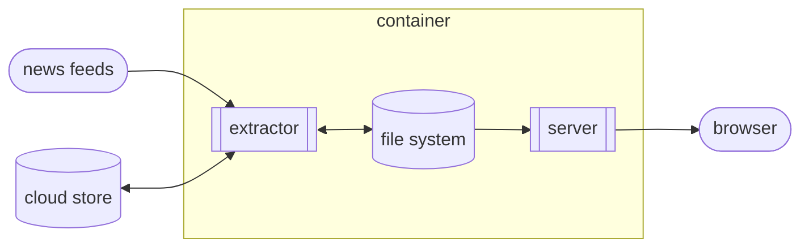

# News

[_News_][0] is my personal aggregator of links from sites that I follow.  You
can find the current list of sources in the [`Feeds.all()`][1] method.

[0]: https://news.donm.cc
[1]: https://github.com/donmccaughey/news_donm_cc/blob/main/src/feeds/feeds.py

[![build and deploy][2]][3] [![codecov][4]][5]

[2]: https://github.com/donmccaughey/news_donm_cc/actions/workflows/build-and-deploy.yaml/badge.svg
[3]: https://github.com/donmccaughey/news_donm_cc/actions/workflows/build-and-deploy.yaml
[4]: https://codecov.io/gh/donmccaughey/news_donm_cc/branch/main/graph/badge.svg?token=z4oPGYrhtM
[5]: https://codecov.io/gh/donmccaughey/news_donm_cc

## Development Setup

1. Install `aws`, `docker`, `jq` and `make`
2. Install `pyenv` and `pyenv-virtualenv`
3. Create a `news-venv` virtual environment using Python 3.10.9 and activate it
4. Run tests: `make check`
5. Run the extractor locally for ad hoc testing: `make extract`
6. Run the server locally for ad hoc testing: `make debug`
7. Run the container locally and shell into it: `make shell`
8. Deploy a new version from the current machine: `make deploy`

## Functional Goals

_News_ was created to turn the ever-shifting top posts home pages of link
aggregators like [_Hacker News_][10] and [_Reddit_][11] into a stable linear
timeline of new items, which frees me from scanning these sites searching for
something new.

[10]: https://news.ycombinator.com
[11]: https://old.reddit.com

With the linear timeline implemented, a few more goals emerged:
 
- include some blog and website feeds
- filter out low quality or uninteresting content
- rewrite links into canonical form

I follow a small number of blogs, so including them here instead of using a
separate feed reading app was natural.  While I'm already filtering out
previously-seen items, filtering out certain websites also made sense. (_Hacker
News_ seems to get a lot of items from [literary magazines and book review
sites][12] for some reason.)  And since I'm de-duplicating items based on URLs,
rewriting links to remove tracking parameters and point to the "nicer" version
of some sites (like [_old.reddit.com_][13] and [_text.npr.org_][14]) came
easily.

[12]: https://github.com/donmccaughey/news_donm_cc/blob/main/src/feeds/skip_sites.py
[13]: https://old.reddit.com
[14]: https://text.npr.org

## Design Goals

The design of _News_ reflects its personal nature.  The most important design
principles are:

- simple
- small
- fast

_News_ is a tool I use every day, multiple times per day.  It needs to be easy
to maintain and extend as news sources change and my interests evolve. A simple
design allows me to make many changes to _News_ in an hour or two.

The scale of _News_ will always be small, which helps enable simplicity
over scalability.  _News_ assumes only one instance is running and that the
_extractor_ and the _server_ run on the same logical computer (e.g. my laptop or
a container in the cloud).  Old stories are dropped after 15 days, so the
working data set stays small.  _News_ is cheap to run and easy to deploy.

A snappy website is just more pleasant to use, so speed is always a goal. _News_
pages are lightweight and stateless (and thus public).  Data is stored to make
web page generation straightforward, and the data set is kept small to keep
reading and parsing times low.

## Architecture

_News_ has two logical components that connect through the local file system.

The _extractor_ is a process triggered every five minutes by a cron job.  It
fetches news items from all sources and reconciles this list with previously
found items.  The _extractor_ stores the updated list on the local file system
and also puts a copy into cloud storage.  If the local news files are missing
(as happens when a new container build is deployed), the _extractor_ will start
fresh with the news data stored in the cloud.  Most of the complexity in the
system, including site filtering and link rewriting, happens in the _extractor_.
Since it runs on a low frequency and is separate from the _server_, this
architecture encourages pushing most calculations into the _extractor_.

The _server_ is a web app that generates a paginated list of news items; the
_server_ checks the modification time of the local news file on each request,
refreshing its list of cached news items when the file changes.

The local file system provides data storage and synchronization for the
_extractor_ and _server_.  Data is stored as JSON in text files.  The
_extractor_ relies on [`rename(2)`][30] to update text files atomically.  The
_server_ polls the news file using [`stat(2)`][31] to detect updates.

[30]: https://linux.die.net/man/2/rename
[31]: https://linux.die.net/man/2/stat

## License

_News_ is available under a [BSD license][40].

[40]: https://github.com/donmccaughey/news_donm_cc/blob/master/LICENSE